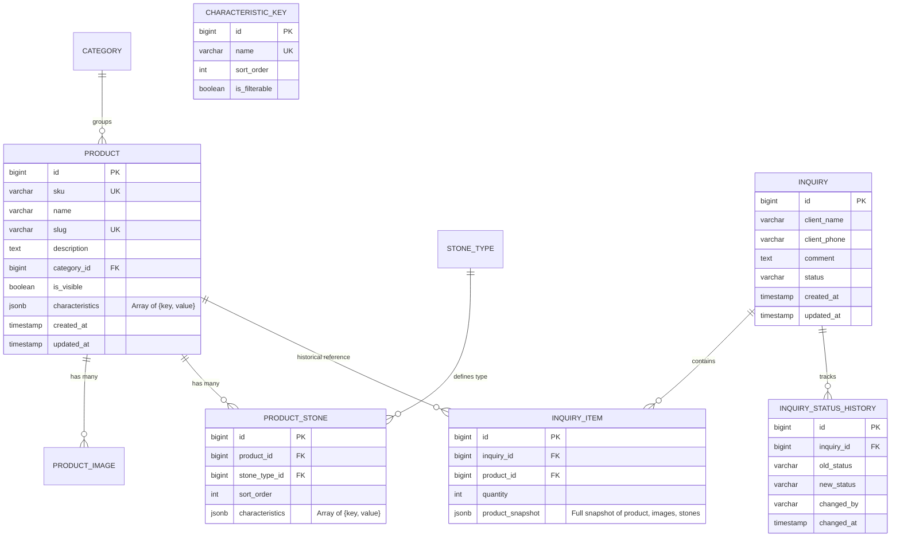

# Архитектура и анализ продукта: Каталог ювелирных изделий мастера (Turnkey / "Под ключ")

## 1. Краткое описание продукта
Сайт-каталог ювелирных изделий ручной работы с возможностью формирования подборки изделий и отправки заявок мастеру напрямую (B2C/Индивидуальный заказ).

**Ключевые отличия от e-commerce:**
- Цены на сайте **не отображаются** (все изделия производятся под заказ с индивидуальным расчетом).
- **Нет модели склада и остатков**: нет понятий "в наличии", "продано", "остаток 0". Одно и то же изделие можно заказать в любом количестве.
- **Нет классического checkout и оплаты**: нет корзины в e-commerce смысле, платежных шлюзов, расчета доставки, промокодов, скидок и налогов.
- **Прямая коммуникация**: на карточке каждого товара доступны прямые контакты мастера ([Telegram], [Позвонить]) как альтернативный быстрый канал связи.
- **Философия проекта**: **"Под ключ" (Zero-Maintenance)** — продукт создается для сдачи клиенту без необходимости дальнейшего технического или DevOps-обслуживания со стороны разработчика.

---

## 2. User journeys

### Клиент (Client Journey)
1. **Главная страница**: Погружение в премиальный визуал бренда, просмотр категорий и новинок.
2. **Каталог**: Поиск по названию/артикулу (с защитой от опечаток) или фильтрация (по категории, металлу, пробе, типу камня).
3. **Карточка товара**:
   - Изучение галереи (зум, свайпы на мобильных, адаптивные WebP/AVIF фото).
   - Ознакомление со всеми динамическими характеристиками изделия и составом камней.
   - Выбор количества (`[ - ] 1 [ + ]`).
   - Добавление изделия кнопкой **"В подборку"** (либо прямой переход в Telegram / звонок).
4. **Моя подборка (`/selection`)**:
   - Автоматическая тихая валидация доступности товаров из `localStorage`.
   - Просмотр добавленных позиций, корректировка количества, удаление ненужного.
   - Заполнение минимальной формы: Имя, Телефон, опциональный Комментарий.
   - Нажатие **"Отправить запрос"**.
5. **Экран благодарности (`/success`)**: Подтверждение отправки и информация о том, что мастер скоро свяжется.

### Мастер / Администратор (Admin Journey)
1. **Авторизация**: Вход в закрытую админ-панель (`/admin/login`) с выдачей JWT в защищенной `HttpOnly` Cookie.
2. **Dashboard**: Просмотр общей статистики, счетчик новых заявок. Автоматическое обновление данных фоновым опросом (polling раз в 30 секунд).
3. **Обработка заявки**:
   - Открытие карточки заявки. Просмотр данных клиента и полного исторического слепка (snapshot) заказанных изделий.
   - Звонок клиенту / связь в мессенджере.
   - Ручной выбор нового статуса (`NEW` -> `CONTACTED` -> `IN_PROGRESS` -> `COMPLETED` или `REJECTED`).
   - Нажатие кнопки **"Сохранить изменения"** (статус фиксируется в БД с записью в историю изменений).
4. **Управление каталогом**:
   - Ведение справочника названий характеристик (добавление/удаление глобальных ключей).
   - Создание/редактирование товара через единую форму: мгновенный drag-and-drop аплоад фото в Cloudinary, выбор характеристик из справочника, добавление блоков камней.
   - Сохранение товара одной кнопкой.

---

## 3. Структура Frontend (Витрина)
- **Технологический стек**: **Next.js (App Router) + React + TypeScript + TailwindCSS + shadcn/ui**.
- **Рендеринг**: SSR (Server-Side Rendering) и SSG/ISR для страниц каталога и товаров, что обеспечивает мгновенную загрузку и идеальную индексацию поисковыми роботами.
- **UI-компоненты**: `shadcn/ui` на базе доступных примитивов Radix UI — обеспечивает премиальный, строгий минималистичный стиль без перегрузки сторонними тяжелыми библиотеками.
- **Управление состоянием подборки**: **Zustand** с middleware `persist` (`localStorage`).
  - Данные подборки сохраняются при перезагрузке, закрытии вкладки или браузера на мобильном.
  - **Тихая валидация (Silent Validation)**: При открытии страницы подборки клиент делает легкий запрос на бэкенд для проверки актуальности `product_id`. Если товар скрыт или удален, он отображается приглушенным с плашкой *"Изделие больше недоступно"* (с возможностью только удалить его из подборки).
- **Оптимизация изображений**: Использование компонента `next/image` в связке с Cloudinary CDN (автоматический выбор формата WebP/AVIF, responsive srcset, ленивая загрузка).

---

## 4. Структура Admin Panel
- **Архитектура**: Встроена в проект Next.js по маршруту `/admin/*` с использованием Client-Side Rendering (CSR). Изолированный лейаут, закрытый middleware-проверкой авторизации.
- **Product Editor UX (Единая форма)**:
  - Единая страница редактирования без многошаговых мастеров (wizard).
  - Фотографии загружаются в облако Cloudinary асинхронно сразу при drop'е файла (появляется превью, доступна drag-and-drop сортировка порядка).
  - Сам товар, его характеристики и камни сохраняются транзакционно по нажатию кнопки **"Сохранить товар"**.
- **Realtime-уведомления о заявках**: Фоновый **Polling (опрос) раз в 30 секунд** (`GET /api/admin/inquiries/new-count`). Если есть новые заявки — на иконке заявок и во вкладке браузера обновляется бейдж. Нулевая нагрузка на сервер, отсутствие хрупких постоянных соединений (WebSockets/SSE).

---

## 5. Все страницы клиентской части сайта
1. `/` — **Главная страница**: Hero-секция с акцентным изделием, промо-баннер бренда, карусель/сетка избранных изделий, быстрый переход к категориям.
2. `/catalog` — **Каталог товаров**: Сетка изделий, поисковая строка с автодополнением/fuzzy-поиском, боковая панель (или drawer) фильтров, пагинация.
3. `/catalog/[categorySlug]` — **Каталог категории**: Тот же каталог с предустановленным фильтром категории.
4. `/product/[slug]` — **Карточка изделия**:
   - Слева: крупная галерея фото, thumbnails, zoom, свайпы.
   - Справа: категория, артикул, название, таблица динамических характеристик, блоки камней, счетчик количества, кнопка "В подборку", кнопки [Telegram] и [Позвонить].
   - Снизу: подробное описание изделия.
5. `/selection` — **Моя подборка**: Список выбранных изделий с миниатюрами, артикулами и счетчиками количества; форма оформления запроса (Имя, Телефон, Комментарий) и кнопка "Отправить запрос".
6. `/success` — **Успешная отправка**: Экран с номером заявки и благодарностью.

---

## 6. Все страницы административной панели
1. `/admin/login` — **Авторизация**: Форма входа для мастера.
2. `/admin/dashboard` — **Панель управления**: Сводка по новым заявкам, быстрые переходы, статус системы.
3. `/admin/inquiries` — **Заявки**: Таблица заявок с бейджами статусов, фильтрацией по статусам и дате.
4. `/admin/inquiries/[id]` — **Детали заявки**: Полные данные клиента, слепок (snapshot) заказанных изделий, блок ручной смены статуса с кнопкой "Сохранить изменения", таймлайн истории статусов.
5. `/admin/products` — **Управление изделиями**: Список товаров, поиск по названию/артикулу, переключатель видимости (`visible`), кнопка перехода к созданию/редактированию.
6. `/admin/products/new` и `/admin/products/[id]` — **Редактор товара**: Единая форма (основные поля, загрузчик фото, динамические характеристики, динамические камни).
7. `/admin/categories` — **Категории**: Список категорий, переименование, изменение порядка отображения, скрытие/показ.
8. `/admin/characteristics` — **Справочник характеристик**: Глобальный реестр названий параметров (например, "Металл", "Проба", "Вес"), возможность добавлять/удалять ключи.
9. `/admin/stone-types` — **Справочник типов камней**: Список названий камней (Бриллиант, Сапфир, Изумруд и т.д.).
10. `/admin/settings` — **Настройки контактов**: Редактирование телефона мастера, username в Telegram, информации "О мастере".

---

## 7. Сущности (Data Entities)
- **AdminUser**: `id`, `username`, `password_hash`, `role`, `created_at`.
- **Category**: `id`, `name`, `slug`, `sort_order`, `is_visible`, `created_at`.
- **CharacteristicKey**: `id`, `name` (уникальное название характеристики, например, "Проба"), `sort_order`, `is_filterable`.
- **Product**: `id`, `sku`, `name`, `slug`, `description`, `category_id`, `is_visible`, `characteristics` (JSONB), `created_at`, `updated_at`.
- **ProductImage**: `id`, `product_id`, `url`, `public_id` (Cloudinary ID), `sort_order`.
- **StoneType**: `id`, `name`, `is_active`.
- **ProductStone**: `id`, `product_id`, `stone_type_id`, `sort_order`, `characteristics` (JSONB).
- **Inquiry**: `id`, `client_name`, `client_phone`, `comment`, `status`, `created_at`, `updated_at`.
- **InquiryItem**: `id`, `inquiry_id`, `product_id`, `quantity`, `product_snapshot` (JSONB).
- **InquiryStatusHistory**: `id`, `inquiry_id`, `old_status`, `new_status`, `changed_by`, `changed_at`.
- **SiteSetting**: `id`, `key`, `value` (для контактов и инфо о мастере).

---

## 8. ER-модель (Схема БД)



---

## 9. Dynamic Attributes Strategy (Характеристики изделия)
- **Модель хранения**: **Гибридный подход (Справочник ключей + JSONB в товаре)**.
- **Справочник ключей (`characteristic_key`)**: Мастер через админку может глобально создавать и удалять имена характеристик ("Металл", "Проба", "Вес", "Цвет золота", "Коллекция"). Это исключает появление дублей и опечаток (например, "Цвет" и "цвет").
- **Формат в `product.characteristics`**:
  ```json
  [
    {"name": "Металл", "value": "Золото"},
    {"name": "Проба", "value": "585"},
    {"name": "Цвет", "value": "Жёлтое золото"},
    {"name": "Вес", "value": "2.20 г"}
  ]
  ```
- **Типизация значений**: Строго **String (текст)**. Никаких сложных плавающих типов. В фильтрах витрины значения агрегируются как точные чекбоксы.
- **Индексация и фильтрация**: GIN-индекс по колонке `characteristics` в PostgreSQL для мгновенного выполнения запросов вида:
  ```sql
  SELECT * FROM product 
  WHERE characteristics @> '[{"name": "Металл", "value": "Золото"}]'
    AND is_visible = true;
  ```

---

## 10. Stone Model (Камни)
- Каждое изделие содержит `0..N` камней (`product_stone`).
- Тип камня выбирается из справочника `stone_type` (Бриллиант, Сапфир, Рубин, Изумруд и др.).
- Характеристики камня также хранятся в JSONB внутри `product_stone.characteristics`:
  ```json
  [
    {"name": "Вес", "value": "0.50 ct"},
    {"name": "Количество", "value": "1"},
    {"name": "Форма", "value": "Round"},
    {"name": "Цвет", "value": "F"},
    {"name": "Чистота", "value": "VS1"}
  ]
  ```
- В карточке товара блок камней не отображается, если камней нет. Если камней несколько — каждый рендерится отдельной аккуратной секцией с собственными параметрами.

---

## 11. Search & Filtering Strategy
- **Поиск (Text Search)**:
  - Реализуется средствами PostgreSQL без внешних сервисов (ElasticSearch не нужен).
  - Расширение `pg_trgm` (триграммный поиск) и GIN-индексы по полям `name` и `sku`:
    ```sql
    CREATE EXTENSION IF NOT EXISTS pg_trgm;
    CREATE INDEX idx_product_trgm ON product USING gin (name gin_trgm_ops, sku gin_trgm_ops);
    ```
  - Обеспечивает нечеткий поиск (fuzzy search): прощает опечатки (например, "калцо" найдет "Кольцо"), ищет по частям слов и артикулам.
- **Фильтрация**:
  - Комбинированный SQL/JPA запрос: фильтрация по категории (`category_id`), наличию камней (наличие записей в `product_stone`), типам камней (`stone_type_id`) и JSONB-характеристикам.

---

## 12. Inquiry Lifecycle & Snapshotting (Жизненный цикл заявки)
1. Клиент нажимает **"Отправить запрос"** в подборке.
2. Бэкенд создает запись в таблице `inquiry` со статусом `NEW`.
3. Для каждого изделия в подборке создается `inquiry_item`, куда сохраняется **полный независимый JSON-снапшот** (`product_snapshot`):
   ```json
   {
     "product_id": 42,
     "sku": "GLD-0052-ULX",
     "name": "Кольцо Multibrand",
     "main_image_url": "https://res.cloudinary.com/.../ring.webp",
     "characteristics": [
       {"name": "Проба", "value": "585"},
       {"name": "Вес", "value": "2.20 г"}
     ],
     "stones": [
       {
         "stone_type": "Бриллиант",
         "characteristics": [{"name": "Вес", "value": "0.50 ct"}]
       }
     ]
   }
   ```
4. **Гарантия историчности**: Даже если мастер через месяц изменит название, состав камней или полностью удалит товар из каталога, в заявке навсегда сохранится точный слепок того, что заказывал клиент.

---

## 13. Status Management (Управление статусами)
- **Допустимые статусы**: `NEW` -> `CONTACTED` -> `IN_PROGRESS` -> `COMPLETED` (альтернативная ветка: `REJECTED`).
- **Явное сохранение (Manual Save)**:
  - При выборе статуса в интерфейсе админки статус не отправляется в БД автоматически.
  - Изменение вступает в силу **только после клика на кнопку "Сохранить изменения"**.
  - Предупреждение (UI prompt) при попытке закрыть вкладку с несохраненным статусом.
  - Администратор имеет право скорректировать ошибочно выставленный статус в любой момент.
- **История изменений**: Каждое сохранение создает строку в `inquiry_status_history` (`old_status`, `new_status`, `changed_by`, `changed_at`).

---

## 14. API Overview

### Публичные эндпоинты (Public API)
- `GET /api/v1/products` — список изделий с пагинацией, фильтрами и поисковой строкой `?q=...`.
- `GET /api/v1/products/{slug}` — детальная информация об изделии.
- `GET /api/v1/categories` — список активных категорий.
- `GET /api/v1/characteristics/filter-keys` — доступные фильтры и их возможные значения.
- `POST /api/v1/inquiries` — создание заявки на основе содержимого подборки (Rate-limited).
- `POST /api/v1/products/validate-batch` — пакетная проверка статуса товаров для подборки (Silent Validation).
- `GET /api/v1/settings/contacts` — публичные контакты мастера (телефон, telegram).

### Административные эндпоинты (Admin API, `HttpOnly` Cookie Auth)
- `POST /api/v1/admin/auth/login` / `POST /api/v1/admin/auth/logout` / `GET /api/v1/admin/auth/me`.
- `GET /api/v1/admin/inquiries` — список заявок с фильтрацией по статусам.
- `GET /api/v1/admin/inquiries/{id}` — просмотр конкретной заявки со снапшотом и историей.
- `PUT /api/v1/admin/inquiries/{id}/status` — сохранение нового статуса.
- `GET /api/v1/admin/inquiries/new-count` — легковесный эндпоинт для 30-секундного polling'а.
- `CRUD /api/v1/admin/products` — создание, редактирование, удаление, смена видимости.
- `POST /api/v1/admin/media/upload` — загрузка фото (проксирование в Cloudinary).
- `PUT /api/v1/admin/products/{id}/images/order` — обновление порядка фото (drag-and-drop).
- `CRUD /api/v1/admin/categories` — управление категориями.
- `CRUD /api/v1/admin/characteristic-keys` — управление глобальным справочником характеристик.
- `CRUD /api/v1/admin/stone-types` — управление справочником камней.
- `PUT /api/v1/admin/settings` — обновление контактов и информации о мастере.

---

## 15. Security (Безопасность)
- **Backend**: Spring Security на базе **Java 21 + Spring Boot 4.1.1**.
- **Хранение JWT**: Токен администратора хранится исключительно в защищенной **`HttpOnly` Cookie** (`SameSite=Strict`, `Secure=true`). JavaScript на клиенте не имеет доступа к токену, что исключает его компрометацию через XSS.
- **Хэширование паролей**: `BCryptPasswordEncoder` с высоким фактором сложности.
- **CORS**: Строго ограничен доверенным доменом витрины Vercel.
- **Защита от спама**: Rate Limiting (Bucket4j) на публичный эндпоинт отправки заявок `POST /api/v1/inquiries` по IP-адресу.
- **Защита от атак**: Отсутствие личных кабинетов покупателей сводит к минимуму поверхность атак на персональные данные.

---

## 16. File & Image Storage (Cloudinary Image CDN)
- Оригиналы фото загружаются через админку в **Cloudinary** (Managed Media Platform).
- База данных хранит только защищенные URL и `public_id`.
- На клиенте и в каталоге используются динамические трансформации Cloudinary:
  - Автоматическая конвертация в WebP/AVIF в зависимости от браузера клиента.
  - Нарезка нужных разрешений "на лету" (миниатюра 120x120 для подборки, 600x600 для каталога, 1600px для зума).
  - Глобальная раздача через CDN.
- **Преимущество для Zero-Maintenance**: На сервере приложений не забивается диск, не расходуется CPU на обработку тяжелых изображений, нет риска падения JVM по OutOfMemoryError.

---

## 17. Performance
- **Next.js SSR/ISR**: Страницы каталога и изделий отдаются уже отрендеренными с сервера с кэшированием (время первого рендера < 300мс).
- **PostgreSQL**: Использование пула соединений HikariCP, GIN-индексы для поиска по триграммам и JSONB-характеристикам.
- **Пагинация**: Стандартная пагинация (по 12–24 товара на страницу) предотвращает перегрузку DOM и сети.

---

## 18. SEO Strategy
- **Автоматическая генерация мета-тегов**:
  - `Title`: `"{Название изделия} | {Имя Мастера/Бренд}"`.
  - `Description`: Первые 150 символов описания изделия.
  - Не требует от мастера ручного заполнения сложных SEO-полей.
- **Человекопонятные URL (ЧПУ)**: Использование читаемых `slug` (например, `/product/koltso-solitaire-multibrand`).
- **Микроразметка JSON-LD**: Разметка Schema.org (`Product`) встраивается в HTML страницы товара для красивых сниппетов в поисковиках.
- **Sitemap & Robots**: Автоматическая генерация `sitemap.xml` средствами Next.js.

---

## 19. Mobile UX
- **Галерея**: Поддержка нативных свайп-жестов, пинч-зума и плавной прокрутки миниатюр.
- **Sticky Bottom Bar**: На мобильном экране кнопка **"В подборку"** фиксируется внизу экрана при прокрутке длинного описания и характеристик.
- **Фильтры**: На мобильных устройствах фильтры открываются во всплывающем нижнем шторке (Bottom Sheet / Drawer) через `shadcn/ui`.
- **Поля ввода**: Использование `type="tel"` и `autocomplete="tel"` для автоматического вызова цифровой клавиатуры при вводе телефона в заявке.

---

## 20. Main Risks & Mitigations (Риски и их устранение)

| Риск | Вероятность | Влияние | Решение / Митигация |
|---|---|---|---|
| **Переполнение диска сервера медиафайлами** | Высокая | Критическое | Использование внешнего Cloudinary; сервер не хранит файлы на диске. |
| **Падение SSL / сбои операционной системы** | Средняя | Критическое | Отказ от самостоятельного VPS. Хостинг на Vercel + Render с автоматическими SSL и автоперезапуском. |
| **Рассинхрон фильтров из-за опечаток мастера** | Высокая | Среднее | Глобальный справочник ключей (`characteristic_key`). Мастер выбирает параметры из выпадающего списка. |
| **Потеря исторической точности заявки** | Высокая | Высокое | Полный JSON-снапшот изделия в `inquiry_item` в момент отправки заявки. |
| **Случайное удаление товаров из локальной подборки** | Средняя | Низкое | Хранение в `localStorage` (Zustand Persist) + тихая валидация статуса без внезапного удаления. |
| **Зависание сессий / WebSocket соединений** | Средняя | Среднее | Замена WebSockets на простой и надежный 30-секундный Polling для уведомлений админки. |

---

## 21. Закрытые архитектурные решения (Decision Log)

1. **Динамические характеристики**: Гибридная модель. Глобальный справочник названий (управляется мастером) + хранение массива пар `name: value` в JSONB. Тип значений — только String.
2. **Снапшот заявки**: Полный JSON-слепок всех полей, характеристик, камней и главного фото товара в момент отправки заявки.
3. **Хранилище медиа**: Cloudinary (Image CDN) — автоформат WebP/AVIF, трансформация на лету, нулевое обслуживание хранилища.
4. **Терминология клиентского флоу**: "Моя подборка" / "В подборку" / "Отправить запрос". Никаких намеков на корзину и онлайн-магазин.
5. **Realtime в админке**: Фоновый HTTP Polling раз в 30 секунд.
6. **Клиентский стек**: Next.js (App Router) + TailwindCSS + `shadcn/ui` + Zustand (`localStorage` persist).
7. **Технология поиска**: PostgreSQL `pg_trgm` (триграммный fuzzy-поиск).
8. **Безопасность сессии админа**: JWT в защищенной `HttpOnly` Cookie.
9. **UX редактора товара**: Единая страница с мгновенной предзагрузкой фото и финальным сохранением по кнопке.
10. **SEO**: Автоматическая генерация мета-тегов по шаблону из контента товара.
11. **Инфраструктура Zero-Maintenance**: Vercel (Frontend) + Render/Railway (Backend) + Managed PostgreSQL (Neon/Supabase).

---

## 22. Рекомендованная финальная архитектура (Production Blueprint)

- **Frontend**: Next.js 15+ (App Router), React 19, TypeScript, TailwindCSS, `shadcn/ui`, Zustand.
- **Backend**: Java 21, Spring Boot 4.1.1, Spring Data JPA, Spring Security, Flyway, Bucket4j.
- **Database**: Managed PostgreSQL 16+ (расширение `pg_trgm`, индексация JSONB GIN).
- **Media & CDN**: Cloudinary.
- **Deployment Platform**:
  - **Frontend**: Vercel.
  - **Backend**: Render / Railway (PaaS).
  - **Database**: Neon.tech / Supabase (Managed Postgres с автоматическими ежедневными бекапами).
